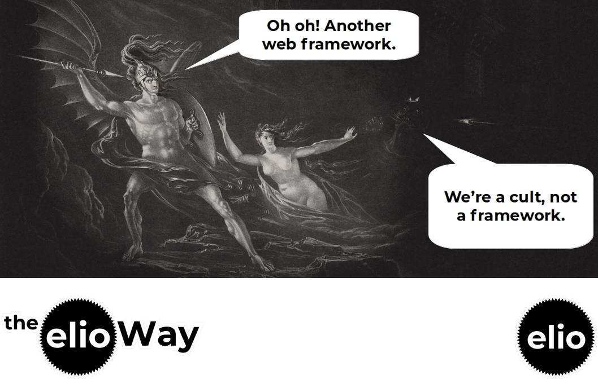

# theElioWay

A software design pattern for building components, functions, and apps with Schema.org `Things`, the elioWay. 

## engage

## Seeing is Believing

Nothing to see... yet.

- [Quickstart theElioWay](./quickstart.md)

## Prerequisites

- [theElioWay Prerequisites](./prerequisites.md)

## Installing

- [Installing theElioWay](./installing.md)

# Credits

- [theElioWay Credits](./credits.md)

## License

[MIT](license)

